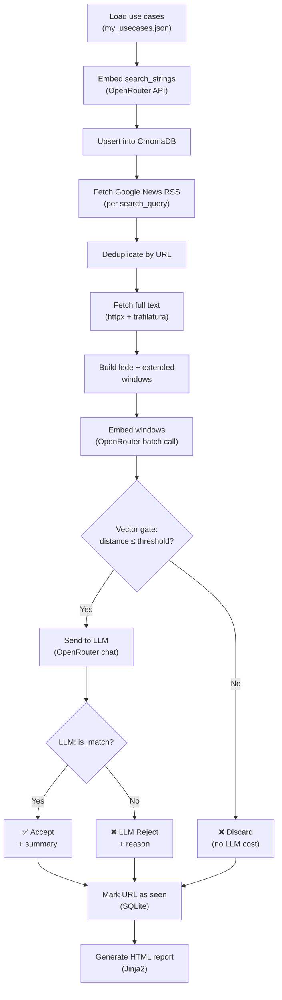

<![CDATA[# 🔍 How the News Digest Pipeline Works

This document walks through the end-to-end process of `news_digest.py` — from RSS ingestion to the final HTML report.

---

## High-Level Architecture

```
┌──────────────────────┐
│   my_usecases.json   │  ← Your topics, queries, and acceptance criteria
└──────────┬───────────┘
           ▼
┌──────────────────────┐
│   Embed & Sync to    │  Use-case search_strings are embedded via OpenRouter
│      ChromaDB        │  and upserted into a persistent vector collection.
└──────────┬───────────┘
           ▼
┌──────────────────────┐
│   Fetch RSS Feeds    │  Google News RSS is queried for each search_query.
│  (Google News RSS)   │  Articles are deduplicated by URL.
└──────────┬───────────┘
           ▼
┌──────────────────────┐
│ Fetch Full-Text Body │  Each article URL is fetched concurrently via httpx.
│    (trafilatura)     │  trafilatura extracts clean body text.
└──────────┬───────────┘
           ▼
┌──────────────────────┐
│  Stage 1: Vector     │  Article text is windowed, embedded, and compared to
│      Gate (cheap)    │  use-case vectors in ChromaDB. Articles above the
│                      │  distance_threshold are discarded.
└──────────┬───────────┘
           ▼
┌──────────────────────┐
│  Stage 2: LLM Gate   │  Remaining articles are evaluated by an LLM via
│    (expensive)       │  OpenRouter. The LLM checks each against the
│                      │  match_criteria and returns accept/reject + reason.
└──────────┬───────────┘
           ▼
┌──────────────────────┐
│ Generate HTML Report │  Accepted articles are rendered into a styled HTML
│                      │  digest. Optionally includes rejected articles.
└──────────────────────┘
```

---

## Step-by-Step Breakdown

### 1. Load & Embed Use Cases

**Function:** `sync_usecases()`

The pipeline begins by reading `my_usecases.json`. Each use case contains:

- **`category`** — e.g. "AI & LLM Developments"
- **`search_queries`** — Google News search terms like `"new LLM model release"`
- **`search_string`** — a paragraph of narrative prose describing ideal articles. This is what gets embedded.
- **`match_criteria`** — natural-language instructions for the LLM's accept/reject decision.

The `search_string` for every use case is sent to OpenRouter's embedding API (`text-embedding-3-small` by default) and the resulting vectors are **upserted into ChromaDB**. This means the vector store always reflects your latest use-case definitions.

---

### 2. Fetch Articles from Google News RSS

**Function:** `fetch_rss_articles()`

For each use case, every entry in `search_queries` triggers a Google News RSS request:

```
https://news.google.com/rss/search?q={query}+when:1d&hl=en-US&gl=US&ceid=US:en
```

- The `when:1d` filter restricts results to the last 24 hours.
- Up to `RSS_ARTICLES_PER_QUERY` (default 3) articles are taken per query.
- URLs are deduplicated within the run.

The result is a flat list of `RawArticle(title, summary, link)` objects.

---

### 3. Extract Full-Text Content

**Function:** `fetch_full_text()`

Each article URL is fetched concurrently using `httpx.AsyncClient` (with a concurrency semaphore of `MAX_CONCURRENT_FETCHES = 8`).

The HTML is processed by **trafilatura** to extract clean body text. If extraction fails or produces fewer than 50 words, the pipeline falls back to the RSS-provided summary.

---

### 4. Build Article Representations (Windowing)

**Function:** `build_representations()`

Rather than embedding the entire article text, the pipeline creates **two fixed windows** designed to catch relevant signal regardless of where it appears:

| Window | Range | Rationale |
|---|---|---|
| **Lede** | Words 0–150 | News is written inverted-pyramid style — the key facts are always at the top. |
| **Extended** | Words 100–500 | Tech articles and research papers often open with generic boilerplate; the real substance starts further in. |

Each window is prepended with the article title and formatted as:
```
Title: <title>
Content: <windowed text>
```

Both representations are embedded in a **single batch API call** (at most 2 embeddings per article).

---

### 5. Stage 1 — Vector Gate (Cheap)

**Function:** `vector_search()`

The article embeddings are queried against the ChromaDB collection. ChromaDB returns the **nearest use case** and its semantic distance.

- **If `distance > distance_threshold` (default 1.2)** → the article is immediately rejected.
  No LLM call is made, saving cost.
- **If `distance ≤ threshold`** → the article passes to Stage 2.

The matched use case's `category` and `match_criteria` are carried forward.

> **💡 Tip:** Use `--dry-run` to see all distances without spending LLM credits. This is the best way to tune your threshold.

---

### 6. Stage 2 — LLM Gate (Expensive)

**Function:** `evaluate_article()` (second half)

For articles that pass the vector gate, the pipeline sends their content to the LLM via OpenRouter with a structured prompt:

**System prompt includes:**
- The matched `category`
- The `match_criteria` from the use case
- Rules for judging relevance (no bias toward specific examples, reject clickbait, etc.)

**The LLM responds with JSON:**

```json
{
  "is_match": true,
  "summary": "2-3 sentence summary with specific facts and why they matter.",
  "rejection_reason": null
}
```

or, when rejected:

```json
{
  "is_match": false,
  "summary": null,
  "rejection_reason": "Article is a generic daily market summary with no significant event."
}
```

The LLM's content is capped at `MAX_CONTENT_WORDS` (default 3000) to protect the context window.

---

### 7. Deduplication via SeenDB

**Class:** `SeenDB`

Every article URL — whether matched, rejected, or errored — is recorded in a **SQLite database** (`seen_news.db`). On the next pipeline run, already-seen URLs are skipped immediately, preventing duplicate processing.

---

### 8. Generate the HTML Report

**Function:** `generate_report()`

Accepted articles are sorted by semantic distance (most relevant first) and rendered into a styled HTML report using **Jinja2**:

- **Matched articles section** — category tag, clickable title, LLM-generated summary, semantic distance.
- **Rejected articles section** *(optional, via `--show-rejects`)* — rejection reason with direct links so you can audit the LLM's decisions.

Reports are timestamped and saved to `reports/`:

```
reports/Digest_2026-03-06_09-02.html
```

---

## Pipeline Flow Diagram



---

## Key Design Decisions

### Why two stages?

Embeddings are **~100× cheaper** than LLM inference. By pre-filtering with vector similarity, the pipeline avoids sending irrelevant articles to the LLM. In a typical run, 60–80% of articles are eliminated at the vector stage.

### Why two embedding windows instead of chunking?

Traditional chunking creates variable-length overlapping segments and requires multiple queries. The fixed two-window approach:
- Guarantees at most **2 embeddings per article** (predictable cost).
- Targets the two most common signal locations in news articles.
- Avoids the complexity of chunk management and merging.

### Why OpenRouter?

OpenRouter provides a **single API** for multiple model providers (OpenAI, Groq, Nebius, etc.), allowing model switching without code changes. It also provides access to both embedding and chat completion endpoints.

### Why SQLite for deduplication?

A lightweight, file-based solution with no external service dependency. WAL mode ensures reliable concurrent access. The table is a simple `(url, processed_at)` pair — minimal storage overhead.

---

## Error Handling & Resilience

| Concern | Strategy |
|---|---|
| API failures | `retry_async()` — exponential backoff with configurable retries |
| Full-text extraction failure | Falls back to RSS summary |
| LLM invalid JSON | Silently skips the article (logged as warning) |
| ChromaDB query failure | Returns infinite distance → article skipped |
| Graceful shutdown | Signal handlers (`SIGINT`, `SIGTERM`) cancel running tasks cleanly |

---

## Typical Run Log

```
09:00:01 [INFO] news_digest — === NEWS DIGEST PIPELINE START ===
09:00:01 [INFO] news_digest — Embedding 9 use-cases…
09:00:02 [INFO] news_digest — Synced 9 use-cases into ChromaDB
09:00:02 [INFO] news_digest — Fetching RSS feeds…
09:00:04 [INFO] news_digest — Collected 87 unique articles from RSS
09:00:05 [INFO] news_digest —   ❌ VECTOR REJECT  dist=1.4523 …
09:00:05 [INFO] news_digest —   🔍 VECTOR PASS    dist=0.8721 …
09:00:06 [INFO] news_digest —   ✅ MATCH [AI & LLM] dist=0.8721 …
09:00:06 [INFO] news_digest —   ❌ LLM REJECT  [Cricket] reason: …
...
09:00:12 [INFO] news_digest — === DONE — 14 matched | 8 LLM-rejected | 65 vector-rejected | 87 total ===
09:00:12 [INFO] news_digest — Report → reports/Digest_2026-03-06_09-02.html
```
]]>
